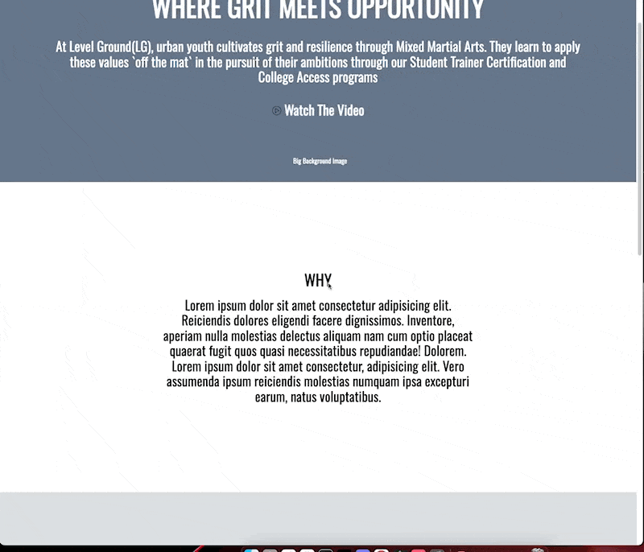

# Level Ground Website

Welcome to the Level Ground website repository! This website is designed to showcase the initiatives and efforts of Level Ground, an organization focused on promoting grit and resilience in urban youth through Mixed Martial Arts. The site is crafted with a responsive design primarily using CSS floats.

## Preview

  

## Key Features

- **Responsive Design**: Built using CSS floats, the website ensures optimal viewing across a range of devices from mobile phones to desktop monitors.
- **Clear Navigation**: The site features a clear navigation bar that provides quick access to essential sections such as 'Classes' and 'Hire Us'.
- **Interactive Sections**: Engaging sections like 'Why MMA?', 'Visit the Gym', and 'Have Us Visit You' are tailored to provide a holistic understanding of Level Ground's mission and services.
- **Volunteer Opportunities**: A dedicated section offering insights into how individuals can contribute and volunteer for Level Ground's initiatives.

## Development

### Prerequisites

Ensure you have the following installed on your local development machine:

- A modern web browser (e.g., Chrome, Firefox, Safari)
- A text editor (e.g., Visual Studio Code, Atom)

### Getting Started

1. Clone the repository to your machine.
2. Navigate to the project directory in your terminal.
3. Open the `index.html` file in a browser to view the website locally.

### Contributing

1. Fork the repository.
2. Create a new branch for your changes.
3. Make your changes and test them locally.
4. Submit a pull request with a clear description of your updates.

## License

This project is licensed under the MIT License. See the `LICENSE` file for details.

---

For more information or queries, feel free to contact the Level Ground team or the website developers.
